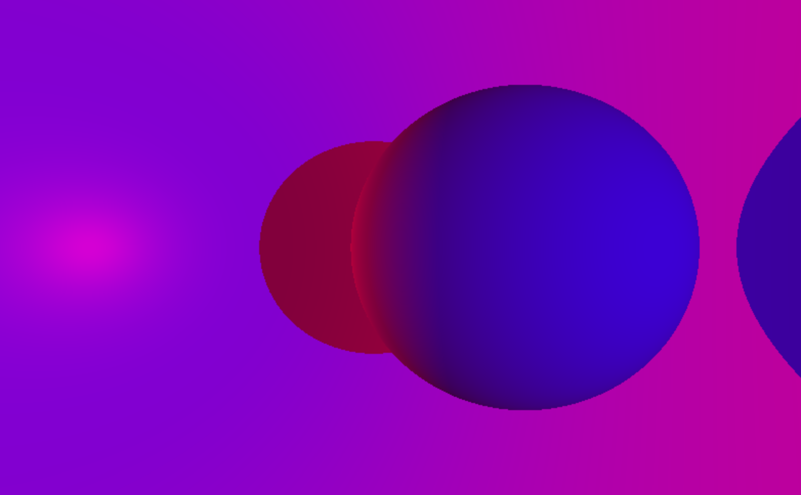
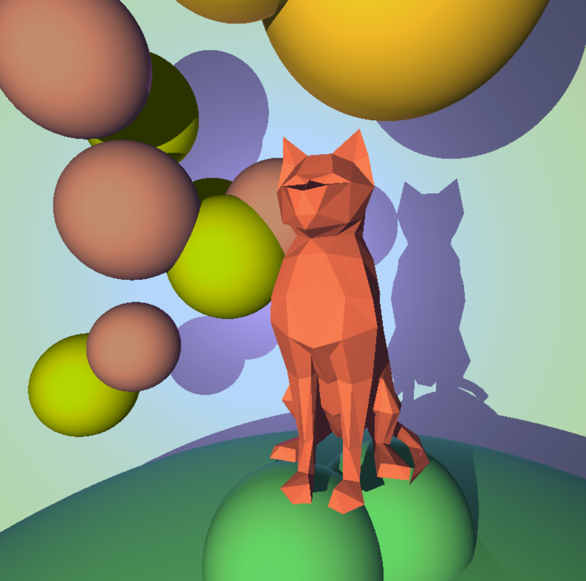

# minirt

## C raytracing project from 42 network

This is a simple raytracing project written in C.

It handles: 
- triangles, 
- planes, 
- capped cylinders, 
- squares,
- spheres,
- multiple lights
- ambient light
- diffuse shading

**Usage**:

> make

> ./minirt scenes/all_objects.rt

The ./scenes folder has some example configuration files

When multiple cameras are configured, you may switch between cameras with your spacebar

You can quit the program with the esc key

**Sinewave animation**

A layer of extra fun was added to the original 42 project assignment:

> ani

Adding the ani identifier in the configuration file will trigger a sine wave animation on the render, as demonstrated in the sine_wave.rt scene

